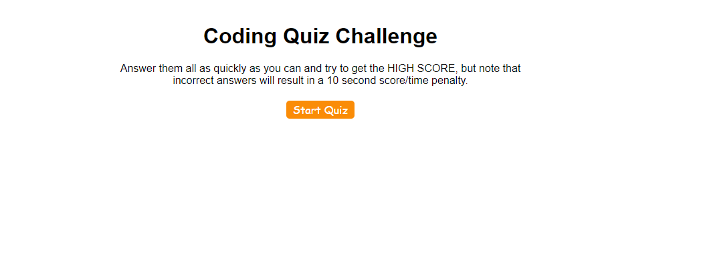
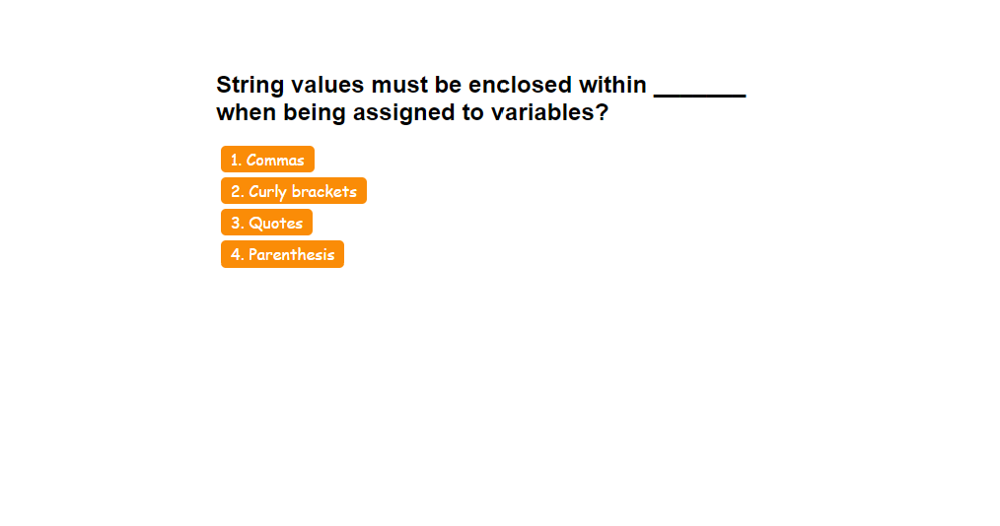
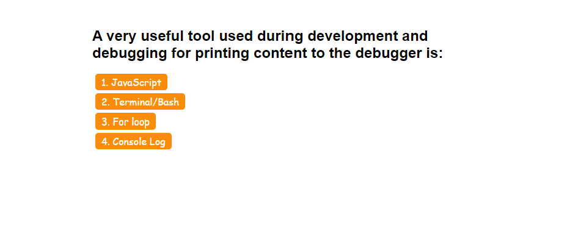
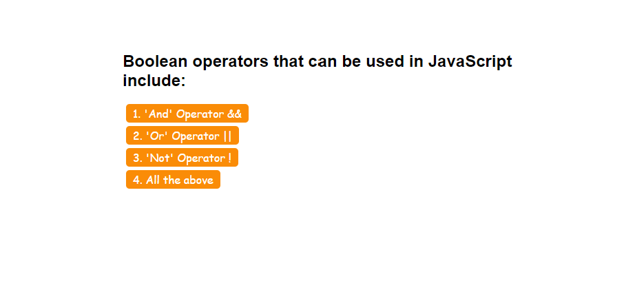

# module-4-challenge
Description
 Create a timed quiz on JavaScript fundamentals that stores high scores

## Installation
N/A

## Usage
GIVEN I am taking a code quiz
WHEN I click the start button
THEN a timer starts and I am presented with a question
WHEN I answer a question
THEN I am presented with another question
WHEN I answer a question incorrectly
THEN time is subtracted from the clock
WHEN all questions are answered or the timer reaches 0
THEN the game is over
WHEN the game is over
THEN I can save my initials and score

## Note
 watch youtube video : https://www.youtube.com/watch?v=AFTvxsVv52k&t=2s&ab_channel=WilliamHorn

https://www.youtube.com/watch?v=rFWbAj40JrQ&list=PLB6wlEeCDJ5Yyh6P2N6Q_9JijB6v4UejF&ab_channel=JamesQQuick

## Credits
N/A

## License
Please refer to the LICENSE in the repo.

## screenshot

## URL
https://austinn789.github.io/module-4-challenge/
git@github.com:AustinN789/module-4-challenge.git